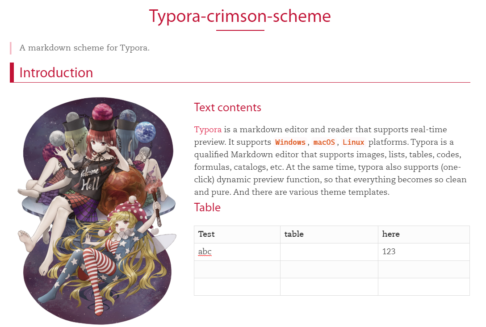

# typora-crimson-theme

A crimson typora theme, currently this is just a slight modification of the [typora-purple-theme](https://github.com/hliu202/typora-purple-theme).

## Example

## Fonts

Fonts can be download and used for achieving the same visualization as the example.

1. For title:  [Myraid](https://fonts.adobe.com/fonts/myriad)
2. For content: [Caecilia LT Pro](https://www.cufonfonts.com/font/caecilia-lt-pro)
3. Mono (Code): [Cascadia Code](https://github.com/microsoft/cascadia-code)

## How to use

1. Install the above fonts (or use what's yours by modifying the `crimson.css`)
2. move the `crimson.css` to the typora theme folder
3. enjoy!

